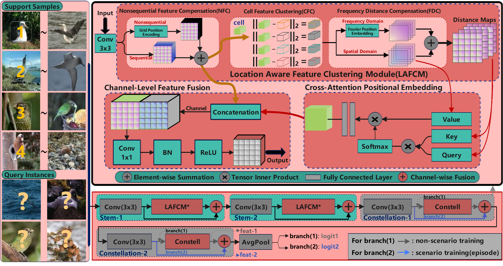

# Shallow Deep Learning Can Still Excel in Fine-Grained Few-Shot Learning


>This package includes our codes for implementing "Shallow Deep Learning Can Still Excel in Fine-Grained Few-Shot Learning". 
(Fully Release Date: 2025-7-30)
>
# Introduction
>*Deep learning has witnessed the widespread adoption across various domains, including few-shot learning. The few-shot learning demands a fusion of deep learning and meta-learning techniques, where commonly used deep backbone networks comprise the ResNet and WRN series. However, the shallow deep learning backbone networks like Conv-4, are not widely favored due to their tendency to extract the shallower features.
In this paper, we first reexamine the relationship between the depth of deep learning networks and their ability to fully learn from a limited number of few-shot instances, and investigate whether shallow deep learning architecture can achieve comparable or superior performance to deep backbone networks.
Drawing inspiration from Conv-4, we introduce the Location-aware Constellation Network (LCN-4), which incorporates the Location Aware Feature Clustering Module. This module adeptly extracts and integrates spatial feature fusion, feature clustering, and recessive location features, thereby mitigating the issue of comprehensive information loss. Specifically, we introduce a general grid position encoding compensation to effectively address the positional information missing in ordinary convolution-extracted feature maps, and propose a general frequency domain location embedding to compensate for location loss in clustering features.*
>
<p align="center"></p>

# Fine-grained Few-shot Datasets Preparation   
benchmarks
```
 materials
├── aircraft-fs
│   ├── aircraft-fs_test.pickle
│   ├── aircraft-fs_train.pickle
│   ├── aircraft-fs_val.pickle
├── cub-cropped
│   ├── cub-cropped_test.pickle
│   ├── cub-cropped_train.pickle
│   ├── cub-cropped_val.pickle
├── flowers-fs
│   ├── flowers-fs_test.pickle
│   ├── flowers-fs_train.pickle
│   ├── flowers-fs_val.pickle
```


# Non-scenario-training & scenario-training, and scenario-testing for Our LCN-4

Train
The following commands provide an example to train the LCN-4.
```bash
# Usage: bash ./scripts/train.sh [Dataset (aircraft-fs, flowers-fs, cub-cropped)] [Backbone] [GPU index] [Tag]
bash ./scripts/train.sh aircraft-fs conv4 0 trial1
```

Evaluate
The following commands provide an example to evaluate the checkpoint after training.
```bash
# Usage: bash ./scripts/test.sh  [Dataset (aircraft-fs, flowers-fs, cub-cropped)] [Backbone] [GPU index] [Tag]
bash ./scripts/test.sh  aircraft-fs conv4 0 trial1
```


# Fine-Grained Few-shot Classification(5way-1shot, -5shot)
*We report the Experimental results (Vision-EResnet12) on CUB-200-2011, Aircraft-fewshot, and VGG-Flowers benchmarks. We conducted three times 1,000 randomly sampled episodes experiments, and report average results for both 1-shot and 5-shot evaluation. More details on the experiments can be seen in the paper.*

### Ⅰ. CUB-200-2011
<table>
         <tr>
             <th rowspan="2" style="text-align:center;">Method(Ours)</th>
             <th colspan="4" style="text-align:center;">5-way-1-shot</th>
             <th colspan="4" style="text-align:center;">5-way-5-shot</th>
         </tr>
         <tr>
             <th colspan="1" style="text-align:center;">Backbone</th>
             <th colspan="1" style="text-align:center;">Pred. Accuracy</th>
             <th colspan="1" style="text-align:center;">Pretrained model</th>
             <th colspan="1" style="text-align:center;">Meta-testing-phase</th>
             <th colspan="1" style="text-align:center;">Backbone</th>
             <th colspan="1" style="text-align:center;">Pred. Accuracy</th>
             <th colspan="1" style="text-align:center;">Pretrained model</th>
             <th colspan="1" style="text-align:center;">Meta-testing-phase</th>
         </tr>
         <tr>
             <td style="text-align:center">ConstellationNet</td>
             <td style="text-align:center">Conv-4</td>
             <td style="text-align:center;">81.69±0.21 </td>
             <td style="text-align:center;"><a href="https://drive.google.com/file/d/1Q1y373DDCyVwcm0ZjepkQfyLWGpWvWpT/view?usp=drive_link">Download</a></td>
             <td style="text-align:center;"><a href="https://drive.google.com/file/d/1CGgDrI_PLB_cGJfLzNCVyetDKuWChGbH/view?usp=drive_link">TestGIF</a></td>
             <td style="text-align:center">Conv-4</td>
             <td style="text-align:center;"> 92.51±0.12 </td>
             <td style="text-align:center;"><a href="https://drive.google.com/file/d/1Q1y373DDCyVwcm0ZjepkQfyLWGpWvWpT/view?usp=drive_link">Download</a></td>
             <td style="text-align:center;"><a href="https://drive.google.com/file/d/1qeO5VmzL8qiJyyft161J0KgCUFnUyvUA/view?usp=drive_link">TestGIF</a></td>
         </tr>
         <tr>
             <td style="text-align:center">LCN-4(Ours)</td>
             <td style="text-align:center">Conv-4</td>
             <td style="text-align:center;">84.43±0.20 </td>
             <td style="text-align:center;"><a href="https://drive.google.com/file/d/1oRijRDbsylG2lEc3LwTGKsumZBJ0KQrt/view?usp=drive_link">Download</a></td>
             <td style="text-align:center;"><a href="https://drive.google.com/file/d/1Msn373TmJegQeskAFYOuXHWkkY5xt99i/view?usp=drive_link">TestGIF</a></td>
             <td style="text-align:center">Conv-4</td>
             <td style="text-align:center;">93.74±0.11 </td>
             <td style="text-align:center;"><a href="https://drive.google.com/file/d/1oRijRDbsylG2lEc3LwTGKsumZBJ0KQrt/view?usp=drive_link">Download</a></td>
             <td style="text-align:center;"><a href="https://drive.google.com/file/d/1DFPvJwNKpBuYPVwZOhcZHPXBODqR1Eco/view?usp=drive_link">TestGIF</a></td>
         </tr>
</table>


### Ⅱ. Aircraft-fewshot
<table>
         <tr>
             <th rowspan="2" style="text-align:center;">Method(Ours)</th>
             <th colspan="4" style="text-align:center;">5-way-1-shot</th>
             <th colspan="4" style="text-align:center;">5-way-5-shot</th>
         </tr>
         <tr>
             <th colspan="1" style="text-align:center;">Backbone</th>
             <th colspan="1" style="text-align:center;">Pred. Accuracy</th>
             <th colspan="1" style="text-align:center;">Pretrained model</th>
             <th colspan="1" style="text-align:center;">Meta-testing-phase</th>
             <th colspan="1" style="text-align:center;">Backbone</th>
             <th colspan="1" style="text-align:center;">Pred. Accuracy</th>
             <th colspan="1" style="text-align:center;">Pretrained model</th>
             <th colspan="1" style="text-align:center;">Meta-testing-phase</th>
         </tr>
         <tr>
             <td style="text-align:center">ConstellationNet</td>
             <td style="text-align:center">Conv-4</td>
             <td style="text-align:center;">81.07±0.22</td>
             <td style="text-align:center;"><a href="https://drive.google.com/file/d/1y3YbHaUSOoDPnF2J9nDQhRzUegOX881v/view?usp=drive_link">Download</a></td>
             <td style="text-align:center;"><a href="https://drive.google.com/file/d/1vwO8x05DG5CMyakHPdRom5l8QEAyA_Of/view?usp=drive_link">TestGIF</a></td>
             <td style="text-align:center">Conv-4</td>
             <td style="text-align:center;">  92.21±0.10 </td>
             <td style="text-align:center;"><a href="https://drive.google.com/file/d/1y3YbHaUSOoDPnF2J9nDQhRzUegOX881v/view?usp=drive_link">Download</a></td>
             <td style="text-align:center;"><a href="https://drive.google.com/file/d/14orUcyPwBx8gufkevFykXMR-kZF9IW04/view?usp=drive_link">TestGIF</a></td>
         </tr>
         <tr>
             <td style="text-align:center">LCN-4(Ours)</td>
             <td style="text-align:center">Conv-4</td>
             <td style="text-align:center;">86.00±0.20 </td>
             <td style="text-align:center;"><a href="https://drive.google.com/file/d/1VUPFfvUv7bXG6VdAdRleHYIusvCBg9MX/view?usp=drive_link">Download</a></td>
             <td style="text-align:center;"><a href="https://drive.google.com/file/d/1mXdN-FCCe3V64Kpm8S5i84CRSYnPtOTQ/view?usp=drive_link">TestGIF</a></td>
             <td style="text-align:center">Conv-4</td>
             <td style="text-align:center;">94.26±0.09 </td>
             <td style="text-align:center;"><a href="https://drive.google.com/file/d/1VUPFfvUv7bXG6VdAdRleHYIusvCBg9MX/view?usp=drive_link">Download</a></td>
             <td style="text-align:center;"><a href="https://drive.google.com/file/d/1c2AG8Mg_kr-0VujjGd1Spg5AS6IOLFHv/view?usp=drive_link">TestGIF</a></td>
         </tr>
</table>


### Ⅲ. VGG-Flowers
<table>
         <tr>
             <th rowspan="2" style="text-align:center;">Method(Ours)</th>
             <th colspan="4" style="text-align:center;">5-way-1-shot</th>
             <th colspan="4" style="text-align:center;">5-way-5-shot</th>
         </tr>
         <tr>
             <th colspan="1" style="text-align:center;">Backbone</th>
             <th colspan="1" style="text-align:center;">Pred. Accuracy</th>
             <th colspan="1" style="text-align:center;">Pretrained model</th>
             <th colspan="1" style="text-align:center;">Meta-testing-phase</th>
             <th colspan="1" style="text-align:center;">Backbone</th>
             <th colspan="1" style="text-align:center;">Pred. Accuracy</th>
             <th colspan="1" style="text-align:center;">Pretrained model</th>
             <th colspan="1" style="text-align:center;">Meta-testing-phase</th>
         </tr>
         <tr>
             <td style="text-align:center">ConstellationNet</td>
             <td style="text-align:center">Conv-4</td>
             <td style="text-align:center;">71.18±0.23 </td>
             <td style="text-align:center;"><a href="https://drive.google.com/file/d/1zHrSvjEZoOSjbXrVD4gxnf5atQZD6v9K/view?usp=drive_link">Download</a></td>
             <td style="text-align:center;"><a href="https://drive.google.com/file/d/1Y7fkIlNOJuHOgPggEWrXldUAOqSJIHK4/view?usp=drive_link">TestGIF</a></td>
             <td style="text-align:center">Conv-4</td>
             <td style="text-align:center;">  85.51±0.15 </td>
             <td style="text-align:center;"><a href="https://drive.google.com/file/d/1zHrSvjEZoOSjbXrVD4gxnf5atQZD6v9K/view?usp=drive_link">Download</a></td>
             <td style="text-align:center;"><a href="https://drive.google.com/file/d/1H02KOXyCVghsZtOr34OFXofvcByJZWjc/view?usp=drive_link">TestGIF</a></td>
         </tr>
         <tr>
             <td style="text-align:center">LCN-4(Ours)</td>
             <td style="text-align:center">Conv-4</td>
             <td style="text-align:center;">73.42±0.22 </td>
             <td style="text-align:center;"><a href="https://drive.google.com/file/d/1Uv8YnLAa-9QkEFA0tS2I-sLevJC6NbnP/view?usp=drive_link">Download</a></td>
             <td style="text-align:center;"><a href="https://drive.google.com/file/d/102pl3aQW8OZydRgxGVvrm2IqrIA_HtgT/view?usp=drive_link">TestGIF</a></td>
             <td style="text-align:center">Conv-4</td>
             <td style="text-align:center;">86.98±0.14 </td>
             <td style="text-align:center;"><a href="https://drive.google.com/file/d/1Uv8YnLAa-9QkEFA0tS2I-sLevJC6NbnP/view?usp=drive_link">Download</a></td>
             <td style="text-align:center;"><a href="https://drive.google.com/file/d/1KPM3-8U1S2mxFPGHqzX7TjXYqt8XzEAB/view?usp=drive_link">TestGIF</a></td>
         </tr>
</table>


# License & disclaimer
- This repository is released under the Apache License 2.0. License can be found in [LICENSE](LICENSE) file.
- *The codes can be used for research purposes only. This package is strictly for non-commercial academic use only.*


# Acknowledgment
- Our code refers the the corresponding code publicly available: [ConstellationNet](https://github.com/mlpc-ucsd/ConstellationNet?tab=readme-ov-file)
- Thanks to [Synchronized-BatchNorm-PyTorch](https://github.com/vacancy/Synchronized-BatchNorm-PyTorch) for providing the tool to synchronize batchnorm statistics when training models with multi-GPUs.
